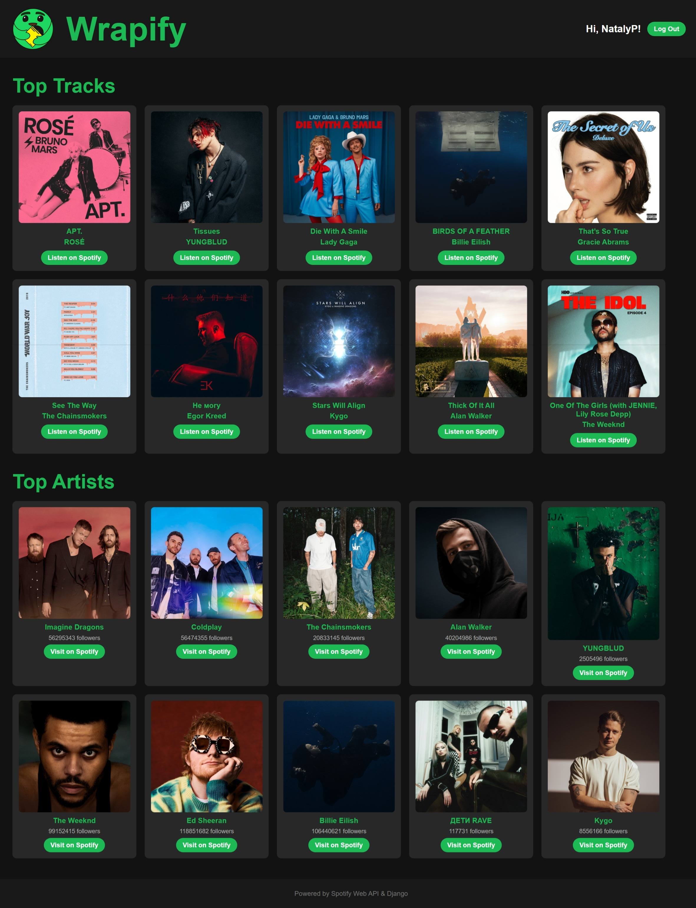

# 🎵 Wrapify – Your Personal Spotify Wrapped

Wrapify is a web-based application built with **Django, Python, HTML, and CSS**, allowing users to visualize their top Spotify artists and tracks dynamically. It provides a **Spotify-like UI** while leveraging the **Spotify Web API** to fetch personalized listening data.

## 🌟 Features
- **Log in with Spotify** to view your **top 10 tracks and artists**.
- Interactive, **Spotify-themed UI** with custom styling.
- Secure authentication using **Spotify OAuth 2.0**.
- **Logout functionality** for account switching.
- Designed with **Django** for the backend, and styled with **HTML & CSS**.

---

## 📸 Example Screenshot



---

## 🎨 Logo Design
The **logo used in Wrapify** was designed by me using **Procreate**.


---

## 🛠️ Technologies Used
- **Django** – Backend framework
- **Python** – Core logic & API handling
- **HTML & CSS** – Frontend UI styling
- **Spotify Web API** – Fetching user listening data
- **Spotipy** – Python wrapper for Spotify API

---

## 🔧 Installation & Setup

### 1️⃣ Clone the Repository
```bash
git clone https://github.com/NatalyP1112/wrapify.git
cd wrapify
```
### 2️⃣ Create a Virtual Environment & Install Dependencies
```bash
python -m venv venv
source venv/bin/activate  # On Windows: venv\Scripts\activate
pip install -r requirements.txt
```
### 3️⃣ Set Up Your Spotify Developer Credentials
You need to create a Spotify Developer Account and register an app:

1. Go to the Spotify Developer Dashboard.
2. Create a new app.
3. Add Redirect URI: http://127.0.0.1:8000/callback
4. Copy the Client ID and Client Secret.

Store those in `config,py`:
```
SPOTIFY_CLIENT_ID = "YOUR_SPOTIFY_CLIENT_ID"
SPOTIFY_CLIENT_SECRET = "YOUR_SPOTIFY_CLIENT_SECRET"
SPOTIFY_REDIRECT_URI = "http://127.0.0.1:8000/callback"
```
🚨 Do NOT share your Client Secret publicly!
### 4️⃣ Apply Migrations & Run Server
```
python manage.py migrate
python manage.py runserver
```
Now visit `http://127.0.0.1:8000/` in your browser and enjoy exploring your top of songs and artists!

---
## 🚀 Usage Guide
1. **Log in** with your Spotify account.
2. View your **top tracks and artists**
3. Click on "Listen on Spotify" to open tracks **directly on Spotify**
4. Click **Log Out** to switch accounts

# Enjoy Wrapify! 🎵💚